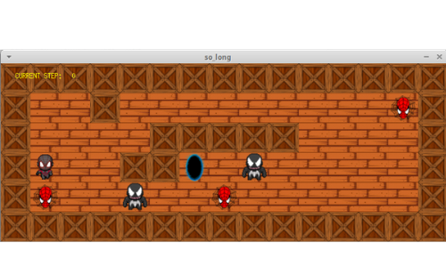

# SO_LONG

## Description  
 This project is a very small 2D game. It is built to make you work with
textures, sprites. And some very basic gameplay elements.

## How play the game
To play this game you can use any map of your choice as long follow the following rues:

* The extension need be `.ber`
* Its must be rectangular, surrounded by wall `1`
* Must have only one exit, only one player and at least one collectible
* Characters allowed:

|  Character  |          Object          |
|:-----------:|:------------------------:|
|     *1*     | wall                     |
|     *0*     | Empty                    |
|     *C*     | collectible              |
|     *E*     | exit                     |
|     *P*     | Player starting position |
|     *V*     | Enemy starting position  |

In folder [map_files](map_files) have some examples of maps.

### Control of play
You can use `AWSD` to move `UP`, `DOWN`, `LEFT`, `RIGHT`.  
For restart the game press `ESC` or click on the red cross of window.
If you touch the enemy you loose the game.
To win the game its necessary pick up all collectible and pass for the exit.

### How execute the game
To start the game you need run the command `make` root directory.
This will compile the executable file `so_long`, to execute its necessary run `./so_long map_files/map.ber` or any map of your choice.

## Makefile rules

| Rule         |                 Description                             |
|:------------:|:-------------------------------------------------------:|
| `make`       | Compile the program.                                    |
| `make clean` | Remove every objects of compilation                     |
| `make fclean`| Do `clean` rule and remove the executable program       |
| `make re`    | Do `fclean` rule and compile the program                |
